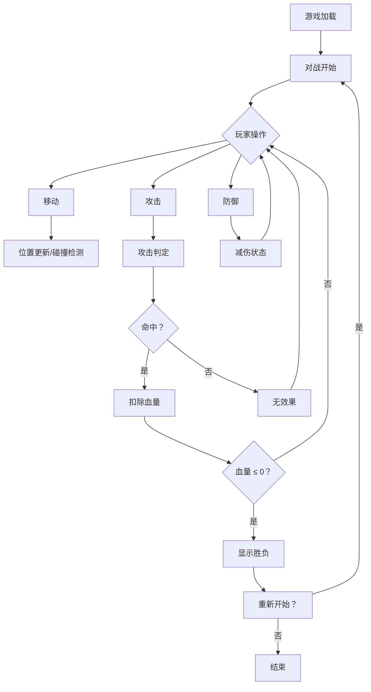

## 1. 产品概述

一款双人像素风格机甲对战小游戏，两名玩家在同一台电脑上分别控制一台像素机甲进行实时对战。
- 目标用户：休闲游戏玩家、复古像素游戏爱好者
- 核心体验：快速上手、操作简单、节奏明快的本地对战乐趣

## 2. 核心功能

### 2.1 用户角色

| 角色 | 控制方式 | 核心操作 |
|------|----------|----------|
| 玩家1 (蓝色机甲) | 键盘 WASD + 攻击/防御键 | 移动、攻击、防御 |
| 玩家2 (红色机甲) | 键盘 方向键 + 攻击/防御键 | 移动、攻击、防御 |

### 2.2 功能模块

1. **对战主场景**：像素风格竞技场，包含地面、背景装饰
2. **机甲角色系统**：双色像素机甲，含待机、移动、攻击、防御动画
3. **战斗逻辑系统**：移动、攻击判定、防御减伤、血量管理
4. **胜负结算系统**：血量归零时判定胜负，显示结算画面
5. **重新开始功能**：对局结束后可一键重新开始

### 2.3 页面详情

| 页面名称 | 模块名称 | 功能描述 |
|----------|----------|----------|
| 对战主场景 | 竞技场背景 | 像素风格地面、天空、装饰元素 |
| 对战主场景 | 机甲角色 | 双色像素机甲，含多帧动画 |
| 对战主场景 | HUD界面 | 双方血条、操作提示 |
| 对战主场景 | 战斗逻辑 | 移动碰撞、攻击判定、防御机制 |
| 结算画面 | 胜负展示 | 显示胜者、重新开始按钮 |

## 3. 核心流程

玩家进入游戏后，两名玩家分别在键盘两侧就位，游戏自动开始。双方操控机甲在竞技场内移动、攻击和防御，通过攻击削减对方血量至零获胜。

## 4. 用户界面设计

### 4.1 设计风格

- **整体风格**：复古像素风 (8-bit/16-bit retro pixel art)
- **主色调**：深蓝紫色 (#1a1a2e) 背景，搭配霓虹蓝 (#00d4ff) 和霓虹红 (#ff0044)
- **按钮样式**：像素块状边缘，无圆角
- **字体**：等宽像素风格字体 (Press Start 2P / monospace)
- **布局**：横版竞技场，左右对称，中间对战
- **动画**：帧动画实现机甲动作，像素级移动

### 4.2 页面设计概览

| 页面名称 | 模块名称 | UI元素 |
|----------|----------|--------|
| 对战主场景 | 竞技场 | 像素天空渐变背景、格纹地面、两侧边界 |
| 对战主场景 | 蓝色机甲 | 32x48像素角色，待机/移动/攻击/防御动画帧 |
| 对战主场景 | 红色机甲 | 32x48像素角色，待机/移动/攻击/防御动画帧 |
| 对战主场景 | HUD | 顶部双方血条(像素边框)、玩家标签、操作提示 |
| 结算画面 | 胜负展示 | 半透明遮罩、胜者文字、重新开始按钮 |

### 4.3 响应式

- 桌面优先，固定画布尺寸 (800x450)
- 根据窗口大小自动居中缩放

## 5. 游戏玩法设计

### 5.1 操作方式

| 操作 | 玩家1 (蓝) | 玩家2 (红) |
|------|------------|------------|
| 向左移动 | A | ← |
| 向右移动 | D | → |
| 跳跃 | W | ↑ |
| 攻击 | J | 1 (数字键) / Enter |
| 防御 | K | 2 (数字键) / Shift |

### 5.2 战斗数值

| 属性 | 数值 |
|------|------|
| 初始血量 | 100 |
| 基础攻击力 | 8 |
| 防御减伤 | 50% (受到伤害减半) |
| 攻击冷却 | 0.5秒 |
| 防御持续 | 0.3秒 (需持续按住) |
| 移动速度 | 3px/帧 |
| 跳跃力度 | -10px/帧 |
| 攻击范围 | 40px (从机甲中心) |

### 5.3 胜负条件

- 任一机甲血量降至0或以下，该方失败
- 显示胜利方并进入结算画面
- 按空格键或点击按钮重新开始