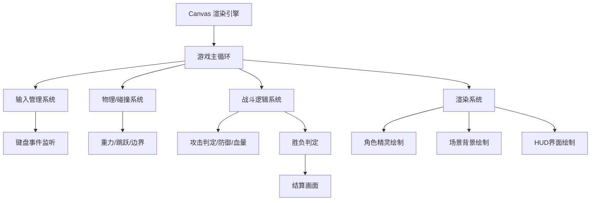

## 1. 架构设计



## 2. 技术选型

- **渲染方式**：HTML5 Canvas 2D API
- **核心技术**：纯 JavaScript (ES6+) + Canvas
- **项目结构**：单 HTML 文件 + 单 CSS 文件 + 单 JS 文件
- **初始化方式**：直接打开 index.html 运行
- **后端服务**：无，纯前端本地双人对战
- **外部依赖**：Google Fonts (Press Start 2P 像素字体)

## 3. 代码结构

```
/workspace/
├── index.html          # 主入口页面
├── style.css           # 样式文件（页面布局、像素风格UI）
└── js/
    ├── main.js         # 游戏入口、主循环、初始化
    ├── game.js         # 游戏状态管理、场景管理
    ├── player.js       # 机甲角色类（移动、攻击、防御、动画）
    ├── renderer.js     # Canvas渲染器（场景、角色、HUD）
    ├── input.js        # 键盘输入管理器
    └── combat.js       # 战斗逻辑（攻击判定、防御、血量）
```

## 4. 核心模块设计

### 4.1 游戏主循环 (main.js / game.js)

- 使用 `requestAnimationFrame` 驱动游戏循环
- 固定时间步长更新逻辑，可变时间步长渲染
- 管理游戏状态：`playing`、`ended`

### 4.2 输入管理器 (input.js)

- 监听 `keydown` / `keyup` 事件
- 维护按键状态映射表
- 支持同时多键按下

### 4.3 机甲角色类 (player.js)

```
class Player {
    x, y          // 位置
    width, height // 尺寸
    hp            // 血量
    speed         // 移动速度
    vx, vy        // 速度向量
    state         // idle / walk / attack / defend / hit
    direction     // left / right
    facing        // 面朝方向
    animFrame     // 动画帧索引
    attackCooldown // 攻击冷却计时器
    isDefending   // 是否防御中
    color         // 机甲主题色
}
```

### 4.4 像素角色绘制 (renderer.js)

- 使用 Canvas API 逐像素绘制机甲精灵
- 每个机甲由多层像素矩形组成（身体、头部、手臂、腿部）
- 根据状态切换不同帧的绘制
- 动画帧循环切换实现运动效果

### 4.5 战斗逻辑 (combat.js)

- 攻击判定：检测攻击方攻击范围与防守方位置的矩形碰撞
- 防御减伤：防守方在防御状态下受到伤害减半
- 击退效果：命中后防守方被击退一段距离
- 攻击冷却：防止连续攻击

## 5. 数据模型

### 5.1 游戏状态

```javascript
{
    state: 'playing' | 'ended',
    winner: null | 1 | 2,
    players: [Player, Player],
    keys: { /* 按键状态 */ }
}
```

### 5.2 机甲精灵定义

机甲采用 32x48 像素的块状像素风格，通过填充矩形绘制：
- **头部**：8x8 像素，含护目镜/面罩
- **身体**：16x16 像素，含装甲纹理
- **手臂**：6x16 像素，可前后摆动
- **腿部**：8x16 像素，步行时交替动画
- **颜色方案**：蓝色机甲 (#4488ff / #2266cc / #0044aa)，红色机甲 (#ff4444 / #cc2222 / #aa0000)

## 6. 素材方案

由于是纯像素风格，所有角色和场景元素均通过 Canvas API 程序化生成，无需外部图片资源：
- **角色精灵**：使用 `fillRect()` 逐块绘制像素机甲
- **场景背景**：渐变天空 + 像素网格地面 + 装饰性元素
- **特效**：攻击时闪现攻击范围指示器，命中时闪烁白色
- **音效**：暂不包含音效（后续可扩展）